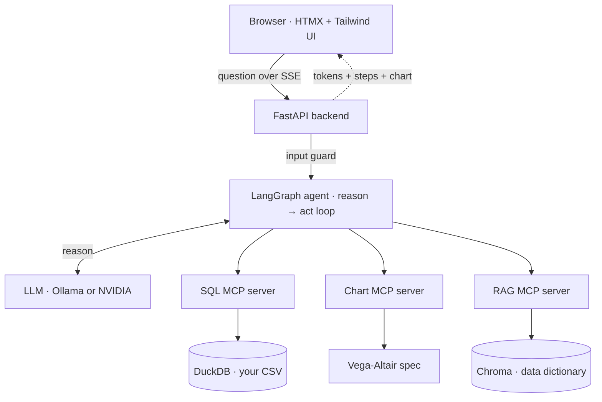

# 📊 Riso Analyst

**An agentic AI data analyst — chat with any CSV and get instant, SQL-powered answers and interactive charts.**

Ask questions in plain English. Riso Analyst writes and runs the SQL, understands your business terms, draws interactive charts, and shows its work — all powered by a single LangGraph agent orchestrating specialized **MCP (Model Context Protocol)** tool-servers.

<!-- Replace with your recorded clip. GitHub embeds MP4s inline; GIFs autoplay. -->


---

## ✨ What it does

- **Chat with your data** — upload any CSV (or use the built-in sample) and ask questions in natural language.
- **Plain English → SQL** — the agent inspects the schema, writes a read-only query, runs it, and answers with the real numbers.
- **Understands business terms** — a RAG-powered data dictionary lets it correctly interpret terms like "Q1", "growth", or "revenue per unit".
- **Interactive charts** — bar, line, scatter, and area charts rendered live in the browser (hover tooltips, no static images).
- **Shows its work** — a live agent activity trail ("examining columns → writing a query → building a chart") plus a collapsible view of the exact SQL behind every answer.
- **Streams everything** — token-by-token answers and step-by-step progress over Server-Sent Events, so it feels instant.
- **Safe by design** — read-only SQL enforcement, prompt-injection filtering, off-topic refusal, and result-size limits.
- **Runs free** — swappable between a local model (Ollama) and a free cloud API (NVIDIA), controlled by a single config file.

---

## 🏗️ Architecture

A single LangGraph agent reasons in a loop and delegates to three specialized MCP servers. Everything except the LLM runs locally and in-process, which keeps it fast.



**How a question flows:** the browser sends it to FastAPI → the input guard runs → the agent checks the schema (and the glossary if needed) → writes a read-only SQL query → runs it against DuckDB → optionally builds a Vega-Altair chart → and FastAPI streams the answer, the agent's steps, and the chart back to the browser live. Langfuse traces the whole trip.

---

## 🧰 Tech stack

| Layer | Tool | Why |
|-------|------|-----|
| Agent orchestration | **LangGraph** (`create_react_agent`) | Stateful reason → act loop |
| Tool protocol | **MCP** + `langchain-mcp-adapters` | Standardized, composable tool-servers |
| Data engine | **DuckDB** | In-process analytical SQL over CSVs — zero latency, no server |
| Charts | **Vega-Altair** | Declarative specs that render as interactive browser charts |
| Retrieval (RAG) | **Chroma** + local embeddings | Business glossary the agent can search |
| Backend | **FastAPI** (async, SSE) | Streaming API for tokens, steps, and charts |
| Frontend | **HTMX + Tailwind** + vanilla JS (`EventSource`) | Fast, elegant riso-style chat UI |
| Observability | **Langfuse** | Traces every agent step and query |
| Evaluation | Custom harness + **Ragas** | Measures correctness, tool-use, and RAG faithfulness |
| Models | **Ollama** (local) / **NVIDIA** (cloud) | Swappable via `.env` — free either way |

---

## 📁 Project structure

```
.
├── backend.py              # FastAPI app: /upload + streaming /stream (SSE)
├── index.html              # Riso-style chat UI (streaming, charts, upload)
├── analyst_agent.py        # Terminal version of the agent (for local testing)
│
├── sql_server.py           # MCP server: list_tables, get_schema, run_query (read-only)
├── knowledge_server.py     # MCP server: search_glossary (RAG over the data dictionary)
├── chart_server.py         # MCP server: make_chart (Vega-Altair specs)
├── guardrails.py           # Shared safety layer (SQL validator, input/output guards)
│
├── ingest_dictionary.py    # One-time: build the RAG index from the data dictionary
├── data_dictionary.md      # Business glossary (definitions, KPIs, rules)
├── sample_data.csv         # Sample sales dataset
├── requirements.txt
└── .env                    # Model + API config (not committed)
```

---

## 🚀 Getting started

### Prerequisites
- Python 3.12+
- Either **Ollama** (for a fully local, free setup) **or** a free **NVIDIA API key** from [build.nvidia.com](https://build.nvidia.com)

### 1. Install
```bash
python -m venv .venv
# Windows:  .venv\Scripts\Activate.ps1
# macOS/Linux: source .venv/bin/activate
pip install -r requirements.txt
```

### 2. Configure the model (`.env`)

**Option A — local (Ollama, free & private):**
```env
OPENAI_BASE_URL=http://localhost:11434/v1
OPENAI_API_KEY=ollama
MODEL=qwen3.5:9b
```
Then pull the models:
```bash
ollama pull qwen3.5:9b
ollama pull nomic-embed-text
```

**Option B — cloud (NVIDIA, free tier, stronger SQL):**
```env
OPENAI_BASE_URL=https://integrate.api.nvidia.com/v1
OPENAI_API_KEY=nvapi-your-key
MODEL=nvidia/nemotron-3-super-120b-a12b
```

> Because everything reads from `.env`, switching between local and cloud is a one-line change — no code edits.

### 3. Build the glossary index (once)
```bash
python ingest_dictionary.py
```

### 4. Run
```bash
uvicorn backend:app --port 8000
```
Open **http://localhost:8000** and start asking questions.

*(Prefer the terminal? Run `python analyst_agent.py`.)*

---

## 💬 Example questions

**Aggregations**
- "Which region made the most total revenue?"
- "What's the average revenue per transaction?"

**Charts**
- "Show total revenue by region as a bar chart."
- "Plot revenue over time as a line chart."
- "Show a scatter chart of profit versus sales."

**Business-term reasoning (uses the glossary)**
- "Which region grew the most from Q1 to Q2?"
- "What's the revenue per unit for each product?"

**Guardrails (safely refused)**
- "Delete all rows from the data table." → *refused (read-only)*
- "What's the weather in Tokyo?" → *refused (off-topic)*

---

## 🛡️ Safety

- **Read-only SQL** — a shared validator (imported by every server) allows only single `SELECT`/`WITH` statements and blocks data-modifying keywords. The agent cannot alter, delete, or drop data.
- **Input guard** — filters prompt-injection attempts and off-topic requests before they reach the model.
- **Output guard** — handles empty responses gracefully.
- **Row cap** — query results are limited so a large query can't overwhelm the app.

---

## 📝 Notes & limitations

- Uploaded CSVs are automatically re-encoded to UTF-8 on upload, so real-world (Latin-1 / Windows-1252) files load cleanly.
- Complex, multi-step analytical SQL (e.g. period-over-period growth) is far more reliable on the cloud model than on a small local model — use Option B for the toughest questions.
- Each question is answered independently for reliability; the app is optimized as a stateless analyst rather than a long multi-turn conversation.

---

## 🎯 About this project

Riso Analyst was built as a capstone in agentic AI and the Model Context Protocol — a single autonomous agent that orchestrates specialized, composable tool-servers to turn plain-English questions into audited, SQL-backed answers and visualizations. It brings together tool-calling agents, MCP, retrieval-augmented generation, streaming, guardrails, evaluation, and a custom web UI into one end-to-end system.

---

*Built with LangGraph, MCP, DuckDB, Vega-Altair, FastAPI, and a lot of debugging.*
