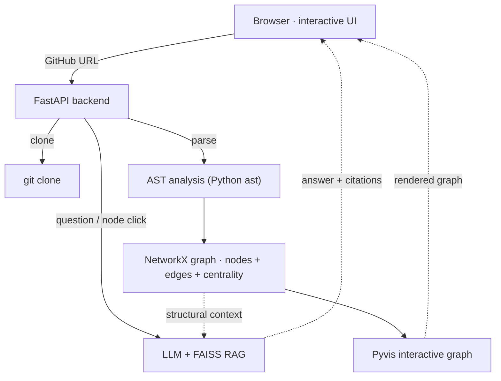

# 🕸️ RepoGraph

**Paste a GitHub repo URL and get an interactive map of the codebase — then ask it questions.**

RepoGraph clones any public repository, analyzes its structure with static code parsing, and renders it as an interactive graph where **files, functions, and classes are nodes** and their **imports and containment are edges**. On top of the graph sits an AI assistant: click any node to have it explained, or ask "how does routing work?" and get an answer grounded in the actual code, with file citations.

<!-- Replace with your recorded clip. GitHub embeds MP4s inline; GIFs autoplay. -->


---

## ✨ What it does

- **Paste a URL → see the graph** — clone and analyze any public GitHub repo right in the browser.
- **Interactive visualization** — drag, zoom, and hover; the most-connected files ("god nodes") are sized larger so architecture pops out.
- **Two views** — toggle between **Detailed** (files + functions + classes) and **Architecture** (a clean file-level import skeleton).
- **Ask the codebase** — an AI chat panel answers questions about the repo using RAG over the code *and* the import graph, with **file citations** on every answer.
- **Click to explain** — click any node and the AI explains that file or symbol and how it fits the wider codebase.
- **Suggested questions** — starter questions generated from the repo's most central files.
- **Live progress + stats** — streamed "Cloning… → Parsing N files…" status, plus a stats bar (files, nodes, edges, god nodes).

---

## 🧠 How it works

The core insight: **the structural graph needs no AI.** File-to-file imports and file-to-function containment come from parsing the code's Abstract Syntax Tree — deterministic, fast, and exact. The AI layer sits *on top* to add explanations and Q&A.



**Pipeline:** `git clone` → **AST parse** (extract files, functions, classes, imports) → **NetworkX** graph (with centrality for god-node detection) → **Pyvis** interactive render. The Q&A layer chunks code + docs into a **FAISS** vector index, retrieves relevant snippets, enriches them with the file's graph connections, and streams a cited answer.

---

## 🧰 Tech stack

| Layer | Tool | Why |
|-------|------|-----|
| Code analysis | **Python `ast`** | Deterministic extraction of structure — no LLM needed |
| Graph engine | **NetworkX** | Graph data + centrality / god-node detection |
| Visualization | **Pyvis** | Interactive, physics-based graph in the browser |
| Backend | **FastAPI** (async, SSE) | Streamed analysis, graph serving, Q&A |
| Retrieval (RAG) | **FAISS** + local embeddings | Searchable index of code + docs |
| Embeddings | **sentence-transformers** (`all-MiniLM-L6-v2`) | Free, local, CPU-friendly |
| LLM | **Ollama** (local) / **NVIDIA** (cloud) | Explanations & Q&A — swappable via `.env` |
| Frontend | HTML + CSS + vanilla JS (`EventSource`) | Futuristic light theme, streaming panel |

---

## 📁 Project structure

```
.
├── graph_backend.py        # FastAPI app: /analyze, /graph, /ask, /explain
├── graph_index.html        # Interactive frontend (graph + Ask AI panel)
├── analyze_repo.py         # The engine: clone → AST → NetworkX → Pyvis render
├── requirements.txt
└── .env                    # Model config (not committed)
```

---

## 🚀 Getting started

### Prerequisites
- Python 3.10+ and `git`
- Either **Ollama** (local, free) or a free **NVIDIA API key** from [build.nvidia.com](https://build.nvidia.com)

### 1. Install
```bash
python -m venv .venv
# Windows:  .venv\Scripts\Activate.ps1
# macOS/Linux: source .venv/bin/activate
pip install -r requirements.txt
```

### 2. Configure the model (`.env`)
```env
# Cloud (recommended for good code explanations):
OPENAI_BASE_URL=https://integrate.api.nvidia.com/v1
OPENAI_API_KEY=nvapi-your-key
MODEL=nvidia/nemotron-3-super-120b-a12b

# — or local via Ollama —
# OPENAI_BASE_URL=http://localhost:11434/v1
# OPENAI_API_KEY=ollama
# MODEL=qwen3.5:9b
```

### 3. Run
```bash
uvicorn graph_backend:app --port 8000
```
Open **http://localhost:8000**, paste a repo URL (or click an example chip), and explore.

---

## 💡 Try it on

- `https://github.com/pallets/flask` — a rich import web; great in Architecture view
- `https://github.com/psf/requests` — clean, readable structure
- `https://github.com/pallets/click` — compact and well-organized

Then click a node to have it explained, or ask *"how does routing work?"* / *"what is this project about?"*

---

## 📝 Notes & limitations

- **Python repos** — structural analysis uses Python's `ast`, so the graph is richest for Python codebases (docs of any type are still indexed for Q&A).
- **Large repos** auto-fall back to the Architecture view for rendering performance (browser physics engines struggle past ~1,500 nodes).
- Edges are **structural** (imports, containment) — accurate by construction. Function-level *call* edges were intentionally left out because they can't be resolved reliably in a dynamically-typed language without producing false connections.

---

## 🎯 About this project

RepoGraph combines deterministic static analysis with an agentic RAG layer to make any codebase both *visible* and *conversational*. It reuses a Model-Context-Protocol-inspired architecture — a graph as a queryable knowledge source, retrieval-augmented answers with citations, and a streaming web UI — to turn "reading an unfamiliar repo" into "exploring a map you can talk to."

---

*Built with Python `ast`, NetworkX, Pyvis, FAISS, and FastAPI.*
